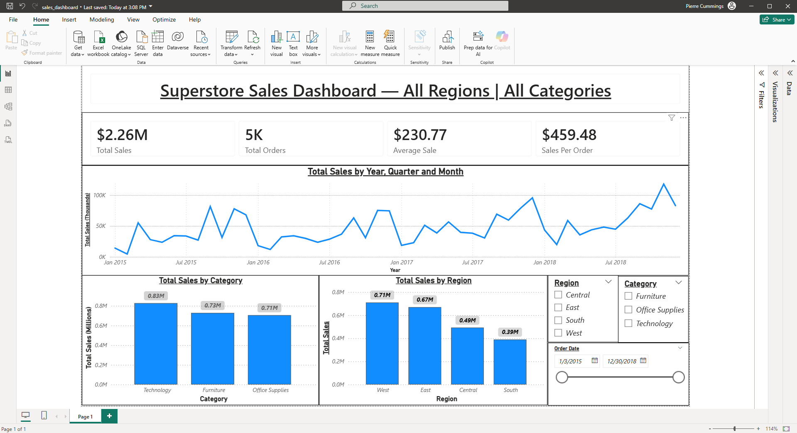

# Hi, I'm Pierre 👋

**Data Analyst** with experience in **operations and process improvement**.

I enjoy transforming raw data into insights that help businesses make better decisions.

---

## Skills

SQL • Python • Power BI • Data Visualization • Data Analysis • Business Intelligence

---

## Tools

- SQL Server
- Power BI Desktop
- Python (Pandas, Matplotlib)
- Jupyter Notebook
- GitHub

---

## Featured Projects

### 📊 Power BI Sales Dashboard
Interactive sales dashboard analyzing retail performance across categories, regions, and time.

Tools:
Power BI • Power Query • DAX

### 📊 Power BI Warehouse Maintenance & Reliability Dashboard
Interactive sales dashboard analyzing retail performance across categories, regions, and time.

Tools:
Power BI • Power Query • DAX

---

### 🗄 SQL Analysis
SQL queries analyzing  data to identify key performance metrics and trends.

Tools:
SQL Server • SQL Server Management Studio

---

### 🐍 Python Data Analysis
Exploratory data analysis using Python to discover patterns in data.

Tools:
Python • Pandas • Matplotlib

---

## Current Focus

Building real-world data analytics projects and expanding my skills in:

- SQL
- Power BI
- Python
- Business Intelligence
- Operations & Reliability
